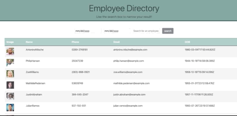

# React-Employee-Directory

This is an application used to look up basic information on employees quickly. 
You can type in the search field to filter by the employees first name or you 
can search for employees with birthdates that fall within a certain time period. I would
eventually like to add sorting and filtering options for the table head fields.

## Deployed

[react-employee-directory](https://jordancley.github.io/react-employee-directory/)

## Author

* **Jordan McQuiston** 